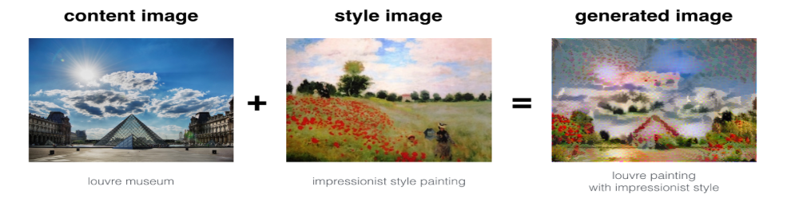
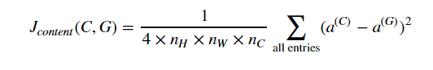
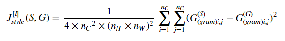

# Neural Style Transfer

Implementation of A Neural Algorithm of Artistic Style paper by Leon A. Gatys, Alexander S. Ecker,  Matthias Bethge,
where style from one image and content from another image is drawn out to generate an art peice.

## Objective

Neural Style Transfer is one of the most fun techniques in deep learning. As seen below, it merges two images, namely: a "content" image and a "style" image, to create a "generated" image.

## Loss Functions

### Content Loss

This loss function takes care that the generated image is similar to the content image.
Any arbritary middle conv layer is selected and both content and target images are passed through the network. Activations at this layer is
recorded of both content and target images. Distance between these activations are calculated using Mean Square Error.
Content Loss is defined as:

### Style Loss

This style function takes care that the generated image is similar to the style image.
A set of arbritary middle conv layer are selected and both style and target images are passed through the network. Activations at these layer are recorded of both style and target images. Gram matrix of each activations are calculated which defines the degree of similarity.
Gram matrices of all layers are considered for calculating the mean squared error.
Style Loss is defined as:

## Optimizer
A fancy Adam optimizer is used to minimize the overall loss.
During backpropagation gradients of images are calculated with respect to the loss function and image pixels are updated based on these
gradients

## Results

